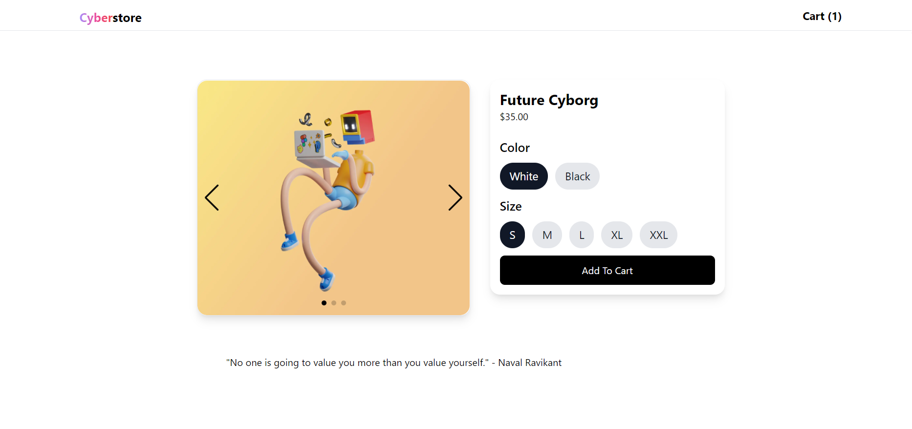

# Cyberstore - Modern eCommerce Website

Extremely shopping experience, an ecommerce project to practice all important concepts of ReactJS, also help me familiar with NextJS include:

- ReactJS concepts: props, hooks (useState, useEffect, useContext).
- NextJS: dynamic routes, layout, fetching, getStaticPaths, getStaticProps, basic SEO.
- Fetching data from Shopify with GraphQL, Storefront API.
- Styling with TailwindCSS, HeadlessUI.
- Smooth scrolling using React-Scroll.

Pages/Funtions:

- Homepage (hero, slogan, product list)
- Product details (variants selection, recommended products)
- Cart (Add/remove products, cart detail)
- Checkout (with Shopify payment)

# Screenshots

You can visit this website here [Live Demo](https://cyberstore.kryonics.me).

